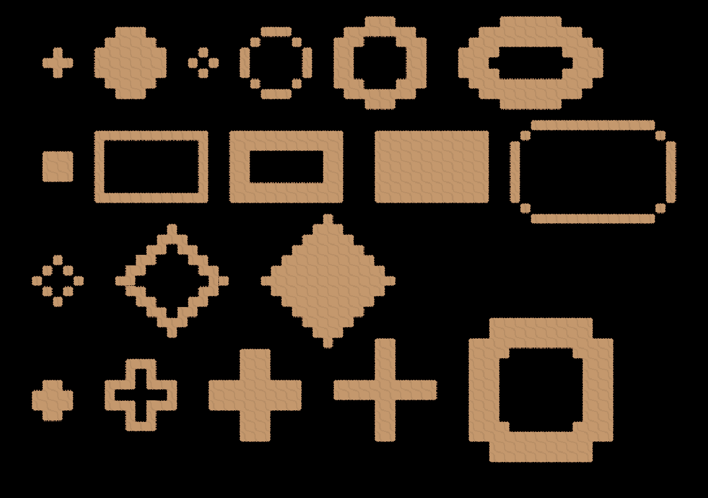

# Godot Tilebrush

This is just a small addon I created to help me paint my 2D tilemap scenes. It has a variey of brush shapes, can draw filled shapes or outlines with a variable border width, and can change the density of the brush.



## Installation

Download this repo, and then copy the `tilebrush` folder into your `addons` folder in the root of your project, e.g. if your `project.godot` file is located at `~/project`, you would do

```sh
# download the repo
git clone https://github.com/dominicprice/godot-tilebrush

# ensure the addons folder exists
mkdir -p ~/project/addons

# copy the tilebrush folder into your addons folder
cp -r godot-tilebrush/addons/tilebrush ~/project/addons/tilebrush
```

Then, inside your editor, navigate using the top menu to Project -> Project settings -> Plugins and then tick the checkbox to enable TileBrush


## Usage

Select a `TileMapLayer` node in your scene, and then click on the `TileBrush` tab in the bottom dock. Select the terrain you wish to paint, modify your brush settings however you like, and then click and drag on the world to paint.

To delete tiles, hold down control and then click and drag over the region you wish to erase.

To select a tileset based on a tile in your world, hold down Alt (Option on mac) to enter eyedrop mode, and click on a tile to select it.

